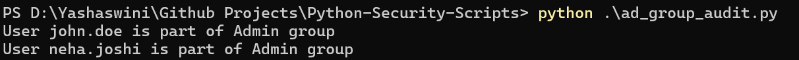
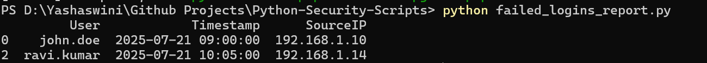
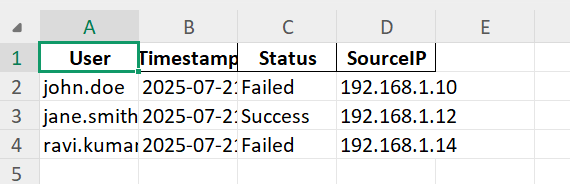
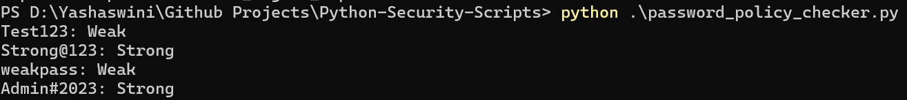
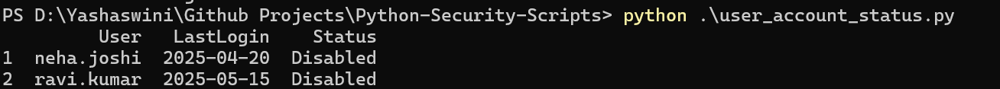

# 🔐 Python Security Scripts

This repository contains real-world Python scripts developed to support common Identity & Access Management (IAM) and Security Operations use cases. These scripts automate security tasks and provide actionable insights — perfect for Entra ID (Azure AD) environments and audit/reporting needs.

> 👩‍💻 **Created by Yashaswini**  
> Security & Data Analyst | IAM | Microsoft Entra ID | Python | Power BI

---

## 📌 Use Cases Covered

| Script Name                  | Functionality                                               |
|-----------------------------|-------------------------------------------------------------|
| `ad_group_audit.py`         | Audits users in privileged AD groups like “Admin”          |
| `failed_logins_report.py`   | Filters and reports failed login attempts                  |
| `generate_excel_report.py`  | Converts raw CSV into styled Excel sheets                  |
| `password_policy_checker.py`| Checks passwords against complexity rules                  |
| `user_account_status.py`    | Flags inactive or disabled accounts for IAM clean-up       |

---

## 📁 Folder Structure

```
Python-Security-Scripts/
├── ad_group_audit.py
├── failed_logins_report.py
├── generate_excel_report.py
├── password_policy_checker.py
├── user_account_status.py
├── requirements.txt
├── README.md
├── sample_data/
│   ├── login_audit_sample.csv
│   ├── ad_group_members.csv
│   └── user_status.csv
├── ad_group_audit.png
├── failed_logins_report.png
├── failed_logins_reportxlop.png
├── generate_excel_report.png
├── password_policy_checker.png
└── user_account_status.png
```

---

## ⚙️ How to Run the Scripts

### ✅ Prerequisites
- Python 3.10+ installed (add to PATH during setup)
- PowerShell or terminal access

### 🧪 Setup

```bash
cd "D:\Yashaswini\Github Projects\Python-Security-Scripts"
python -m pip install -r requirements.txt
```

---

## ▶️ Script Execution & Screenshots

Each script is independently executable. Below are output visuals for better understanding:

### 🔍 Script Outputs

#### ✅ AD Group Audit  


#### ✅ Failed Login Report  


#### ✅ Failed Login (Detail View)  


#### ✅ Excel Report Output  


#### ✅ Password Policy Checker  


#### ✅ User Account Status  


---

## 🔍 Sample Data Source Files

| File Name              | Description                              |
|------------------------|------------------------------------------|
| `login_audit_sample.csv`| Login attempts with timestamps & status |
| `ad_group_members.csv` | AD group memberships                     |
| `user_status.csv`      | User activity and status info            |

> All sample data is mocked for demo purposes only.


## 📫 Contact

- 💼 [LinkedIn – suryawanshiyashaswini](https://www.linkedin.com/in/suryawanshiyashaswini/)
- ✉️ Email: suryawanshi.yashaswini@gmail.com
- 💻 GitHub: [@suryawanshiyashaswini](https://github.com/suryawanshiyashaswini)

---
